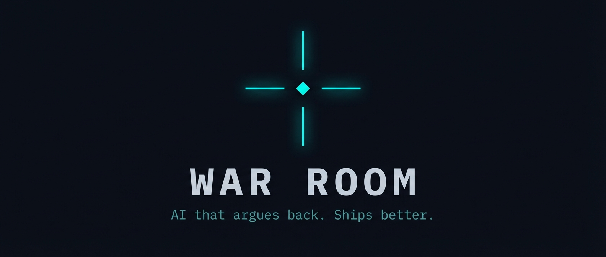

<p align="center">
  
</p>

<p align="center">
  <strong>Multi-agent decisions with a built-in devil's advocate.</strong><br>
  Free. Open source. MIT.
</p>

<p align="center">
  <a href="#quick-start">Quick Start</a> •
  <a href="#how-it-works">How It Works</a> •
  <a href="#the-protocols">Protocols</a> •
  <a href="#when-to-use-it">When To Use</a> •
  <a href="references/dna-template.md">Full DNA</a>
</p>

---

## What Happened

We ran the same project through a standard multi-agent session, then through War Room.

| | Standard | War Room |
|---|---|---|
| **Features** | 10 (over-scoped) | 8 (each justified) |
| **Cuts** | 0 features questioned | 6 cut (saved 5 dev-days) |
| **Risks** | Surface-level list | Root cause analysis + switch costs |
| **Timeline** | "16 days" (optimistic) | "18 days + buffer" (honest) |
| **Critical miss** | No auto-update | Auto-update moved INTO MVP |
| **Alternatives** | 0 explored | 3 counter-proposals, best kept as Plan B |

Same model. Same input. Different operating system.

---

## Quick Start

```bash
# 1. Initialize a war room
bash scripts/init_war_room.sh my-project

# 2. Write your brief
# Edit war-rooms/my-project/BRIEF.md — what are you building? what constraints?

# 3. Inject the DNA
cp references/dna-template.md war-rooms/my-project/DNA.md

# 4. Tell your agent: "Run a war room on my-project"
# It handles wave orchestration, agent spawning, and CHAOS integration.
```

The agent reads the DNA, picks the right specialists, runs them in waves, unleashes CHAOS after each wave, and consolidates everything into a blueprint.

### OpenClaw Skill Install

If you're using [OpenClaw](https://github.com/openclaw/openclaw):

```bash
openclaw skill install war-room
```

---

## How It Works

### Agents

Pick 4–13 specialists based on your problem:

| Role | When to use |
|------|-------------|
| **ARCH** | System architecture, tech choices |
| **PM** | Scope, requirements, roadmap |
| **DEV** | Implementation, code feasibility |
| **SEC** | Threats, compliance, privacy |
| **UX** | Interface, interaction design |
| **QA** | Testing, edge cases |
| **MKT** | Positioning, launch strategy |
| **RESEARCH** | Market/tech research, competitive analysis |
| **FINANCE** | Costs, projections, pricing |
| **LEGAL** | Contracts, IP, regulatory |
| **CHAOS** | **Always. Non-negotiable.** |

Custom roles welcome: `AI-ENG`, `AUDIO`, `DATA`, `OPS` — whatever the problem needs. See [agent-roles.md](references/agent-roles.md) for the full roster and template.

### Waves

Agents run in dependency order, not all at once:

```
Wave 1: Foundation    ARCH + SEC + PM        → decisions others depend on
Wave 2: Specialists   UX + AUDIO + AI-ENG    → build on Wave 1
Wave 3: Builders      DEV + OPS              → implement based on Wave 1+2
Wave 4: Validators    QA + MKT + CHAOS       → stress-test everything
```

CHAOS shadows **every** wave. Not just the end. See [wave-protocol.md](references/wave-protocol.md) for the full execution protocol.

### The CHAOS Agent

The built-in devil's advocate. Attacks every assumption. Rates every decision:

- **SURVIVES** — withstands scrutiny
- **WOUNDED** — valid but has weaknesses to address
- **KILLED** — doesn't hold up, needs rethinking

CHAOS also produces **counter-proposals** — alternative approaches nobody else considered. In our test run, CHAOS found that 4 of the top 5 failure scenarios came from a single dependency — something the other 12 agents missed.

---

## The Protocols

19 structured decision protocols across 4 pillars. Not suggestions — constraints that every agent must follow.

### Essential 7 (start here)

| Protocol | What it forces |
|----------|---------------|
| **Opposite Test** | State the opposite decision and argue FOR it |
| **Five Whys** | Dig to root cause, not surface symptoms |
| **Ignorance Declaration** | Declare KNOWN / UNKNOWN / ASSUMPTION before analyzing |
| **Via Negativa** | List 3 things to REMOVE before adding anything |
| **Plan B** | Every critical decision needs a backup with switch cost |
| **Pre-Mortem** | "How does this fail in production?" before declaring done |
| **CHAOS** | Adversarial review of all decisions |

### Advanced 12 (power users)

The full DNA adds: Dialectic Obligation, Mirror Test, Ripple Analysis, Tension Map, Causal Chain Verification, Tempo Tagging, Create-Then-Constrain, Barbell Strategy, and Lessons Permanent.

→ **[Full DNA with all 19 protocols](references/dna-template.md)**

---

## What It Produces

```
war-rooms/my-project/
├── BRIEF.md              ← Your project description
├── DNA.md                ← The operating protocols
├── DECISIONS.md          ← Append-only decision log
├── STATUS.md             ← Agent completion tracking
├── BLOCKERS.md           ← Issues requiring human input
├── TLDR.md               ← Executive summary
├── agents/
│   ├── arch/             ← Architecture specs
│   ├── pm/               ← Product requirements
│   ├── chaos/            ← Challenges + counter-proposals
│   └── [role]/           ← Any specialist
├── artifacts/
│   └── BLUEPRINT.md      ← Consolidated output
├── comms/                ← Inter-agent messages
└── lessons/              ← Post-mortem learnings
```

---

## When To Use It

**Use it when:**
- Decisions cost weeks of work if wrong
- You need multiple perspectives but don't have multiple people
- You need a PRD, architecture, or strategy that survives contact with reality
- You want to stress-test an existing plan before committing

**Don't use it when:**
- The task is simple and well-defined (just ask your AI directly)
- You need a quick answer, not a deep analysis
- You've already decided and just need execution

---

## Examples

**Software:** "Build a macOS app for AI music generation" → 4 waves, 13 agents, 57 decisions, 32 docs, complete blueprint in 35 minutes.

**Business:** "Should I pivot from B2C to B2B?" → CHAOS attacks both sides, Five Whys finds the root cause isn't the business model, counter-proposal identifies a third option.

**Creative:** "Plan the launch strategy for an open-source project" → MKT positioning, RESEARCH competitive landscape, CHAOS finds the distribution strategy is missing.

---

## FAQ

**"Isn't this just prompt engineering?"**
The protocols ARE structured prompts. That's the point. "Prompt engineering" that produces measurably different results isn't a dismissal — it's a description. The question isn't whether it's prompt engineering. It's whether it works. Run a war room and compare the output to your usual workflow.

**"Why would I want AI to disagree with me?"**
You don't want disagreement. You want accuracy. The CHAOS agent doesn't disagree for sport — it stress-tests decisions so the ones that survive are the ones worth shipping. It's the difference between "great idea!" and "great idea, but here's how it fails."

**"19 protocols is too many."**
Start with the Essential 7. They cover 80% of the value. The other 12 are there when you want deeper analysis. You don't need to learn all 19 to get started — you need to run `init_war_room.sh` and write a brief.

**"How is this different from CrewAI / AutoGen / MetaGPT?"**
Those are agent orchestration frameworks — they help you run multiple agents. War Room is a **decision methodology** that happens to use multiple agents. The difference is the DNA: mandatory protocols that force agents to question assumptions, declare ignorance, and attack their own conclusions. You could implement War Room on top of CrewAI if you wanted.

---

## Contributing

War Room is open source because the best knowledge is the kind that's passed forward.

Ways to contribute:
- **New agent roles** — domain-specific specialists
- **Protocol refinements** — improvements to the DNA
- **Example war rooms** — complete session outputs for different problem types
- **Translations** — the DNA in other languages

---

## License

MIT. Use it, fork it, build on it.

---

<p align="center">
  
</p>

<p align="center">
  <em>"The unexamined life is not worth living."</em> — Socrates<br>
  <em>"Wind extinguishes a candle and energizes fire."</em> — Nassim Taleb<br>
  <em>"O melhor conhecimento é aquele que é passado adiante."</em> — Max Kleinz
</p>

<p align="center">
  Created by <a href="https://github.com/maxkle1nz">Max Kleinz</a> / COSMOPHONIX
</p>
